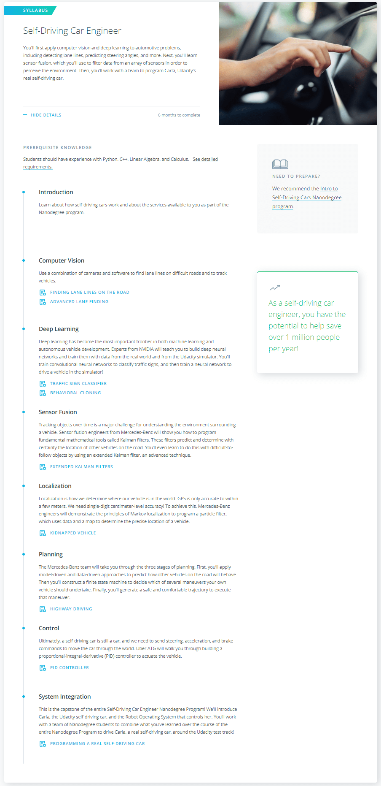

# [Self-Driving Car Engineer Nanodegree](http://www.udacity.com/drive) 

#### Become a Computer Vision Expert

Self-driving cars are transformational technology, on the cutting-edge of robotics, machine learning, and engineering. Learn the skills and techniques used by self-driving car teams at the most advanced technology companies in the world.

## What You Will Learn.

## [Syllabus pdf](https://d20vrrgs8k4bvw.cloudfront.net/documents/en-US/Self-Driving+Car+Nanodegree+Syllabus.pdf)
